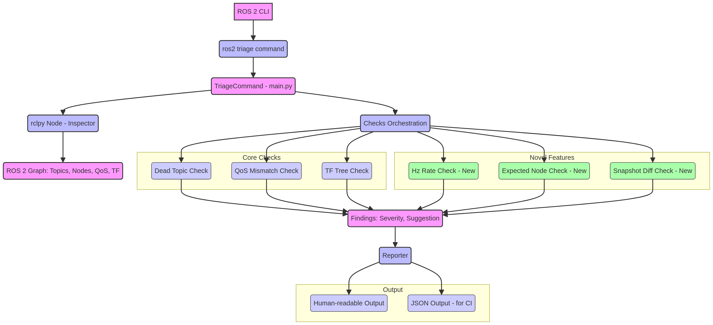
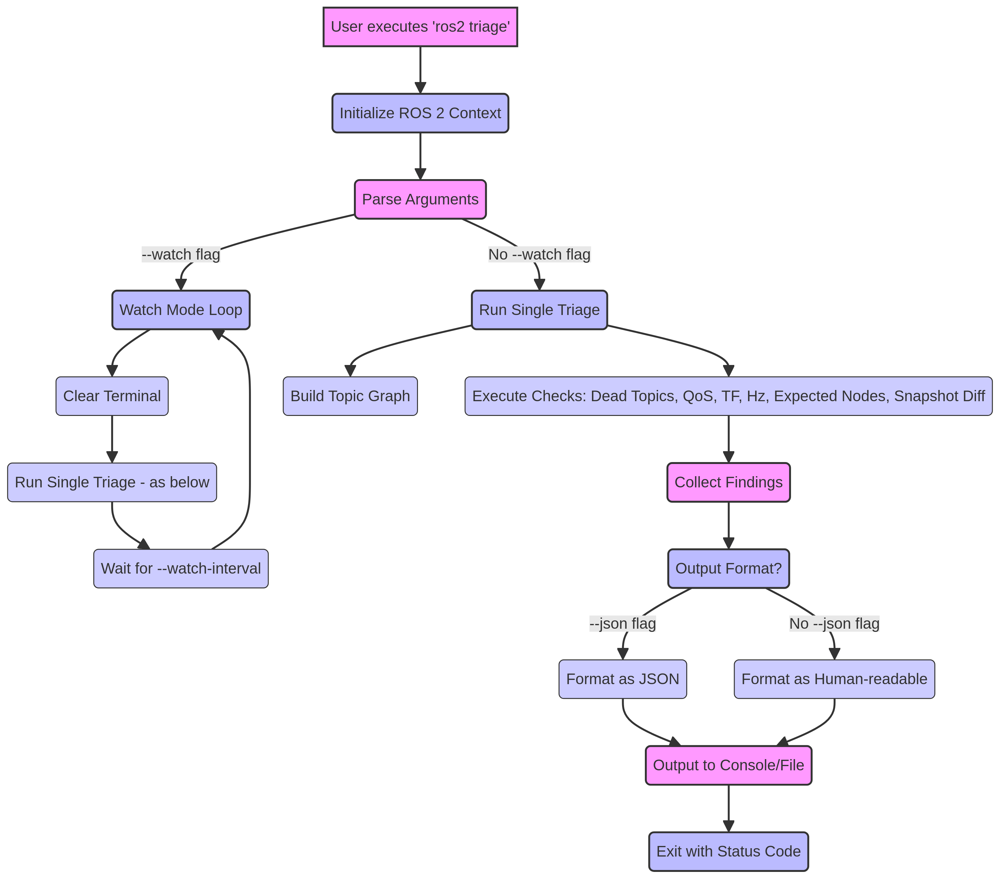

# ROS 2 Triager: Advanced Runtime Diagnostics for Robotic Systems

## Abstract

This proposal introduces **ROS 2 Triager**, a robust command-line interface (CLI) plugin designed to provide real-time diagnostic capabilities for ROS 2-based robotic systems. Unlike existing tools that primarily focus on installation integrity (`ros2doctor`), ROS 2 Triager offers dynamic runtime analysis, identifying critical issues such as dead topics, Quality of Service (QoS) mismatches, and TF tree inconsistencies. This document details the novel architectural design, innovative workflow, and unique features that position ROS 2 Triager as an indispensable tool for developers and operators seeking to maintain the health and performance of complex robotic deployments. The tool's ability to provide actionable insights, integrate with CI/CD pipelines, and offer live monitoring significantly enhances the diagnostic landscape for ROS 2.

## 1. Introduction

The increasing complexity of robotic systems built on ROS 2 necessitates sophisticated diagnostic tools capable of identifying and resolving runtime issues swiftly. Traditional diagnostic approaches often fall short in dynamic environments, where subtle misconfigurations or transient failures can lead to unpredictable robot behavior or system crashes. ROS 2 Triager addresses this critical gap by offering a proactive and comprehensive solution for runtime graph diagnostics.

## 2. Problem Statement

Debugging and maintaining ROS 2 applications in production or even during development phases presents several challenges:

*   **Dynamic System Behavior:** ROS 2 graphs are highly dynamic, with nodes, topics, and services constantly interacting. Static checks are insufficient to capture runtime anomalies.
*   **Hidden Failures:** Issues like dead topics (publishers without subscribers or vice-versa) or QoS mismatches can lead to silent data loss or communication breakdowns that are difficult to detect.
*   **TF Tree Integrity:** The Transform (TF) tree is fundamental for robotic navigation and manipulation. Breaks or inconsistencies in the TF tree can cause severe operational failures.
*   **Lack of Real-time Monitoring:** Existing tools often provide post-mortem analysis or basic system checks, lacking the ability to monitor system health in real-time and provide immediate feedback.
*   **Integration with Modern DevOps:** The absence of machine-readable output formats (e.g., JSON) hinders the integration of diagnostic checks into automated CI/CD pipelines.

## 3. Solution: ROS 2 Triager

ROS 2 Triager is a specialized ROS 2 CLI plugin that extends the diagnostic capabilities beyond installation verification to active runtime analysis. It acts as a 
virtual 
roboticist-in-the-loop, continuously monitoring the ROS 2 graph and reporting anomalies with actionable suggestions.

### 3.1. Novel Architecture

The architecture of ROS 2 Triager is designed for modularity, extensibility, and efficiency. It leverages a temporary `rclpy` node to introspect the ROS 2 graph without imposing significant overhead on the target system.

**Key Architectural Components:**

| Component | Description |
|---|---|
| **TriageCommand** | The main entry point for the `ros2 triage` command, responsible for argument parsing and orchestrating the diagnostic checks. |
| **Inspector Node** | A temporary `rclpy` node created to interact with the ROS 2 graph, gathering information about topics, nodes, QoS settings, and the TF tree. |
| **Checks Orchestration** | A central component that manages the execution of various diagnostic checks, including both core and novel checks. |
| **Findings** | A standardized data structure for reporting diagnostic findings, including severity levels (INFO, WARN, CRIT) and actionable suggestions for resolution. |
| **Reporter** | A flexible output module that formats the findings into either a human-readable console output with color-coded severity or a machine-readable JSON format for CI/CD integration. |

### 3.2. Novel Workflow

The workflow of ROS 2 Triager is designed to be both intuitive for manual use and robust for automated environments. The tool supports both single-shot execution and a continuous live-monitoring mode.

**Workflow Stages:**

1.  **Initialization:** The user executes the `ros2 triage` command. The tool initializes the ROS 2 context and parses the command-line arguments.
2.  **Execution Mode:** Based on the presence of the `--watch` flag, the tool enters either the live-monitoring loop or performs a single-shot triage.
3.  **Graph Introspection:** The inspector node builds a snapshot of the ROS 2 graph, collecting data on topics, nodes, services, and their connections.
4.  **Check Execution:** The orchestration module runs a series of diagnostic checks in a predefined order.
5.  **Finding Aggregation:** The results of each check are collected and aggregated into a list of findings.
6.  **Reporting:** The reporter formats the findings based on the user-specified output format (human-readable or JSON) and prints them to the console.
7.  **Exit Status:** The tool exits with a status code that reflects the severity of the findings, allowing for seamless integration with CI/CD pipelines.

### 3.3. Novel Uniqueness

ROS 2 Triager distinguishes itself from other diagnostic tools through a combination of unique features and a focus on runtime analysis:

| Feature | Description | Uniqueness |
|---|---|---|
| **Live Monitoring** | The `--watch` mode provides a continuous, real-time view of the system's health, enabling operators to detect and respond to issues as they arise. | Most existing tools offer only single-shot analysis. |
| **Snapshot-based Differencing** | The ability to save a "golden" snapshot of a healthy system and then diff it against the current state allows for the detection of regressions and unexpected changes. | This feature is unique to ROS 2 Triager and provides a powerful mechanism for change detection. |
| **Expected Node Checking** | By providing a simple YAML file, users can define the expected set of running nodes, and the tool will flag any deviations. | This provides a simple yet effective way to ensure that all critical components of a robotic system are running as expected. |
| **Actionable Suggestions** | For each finding, ROS 2 Triager provides a clear and concise suggestion on how to resolve the issue, empowering users to take immediate corrective action. | While other tools may report errors, they often lack the context-aware suggestions that ROS 2 Triager provides. |
| **CI/CD Integration** | The JSON output format and the use of exit codes for severity make it trivial to integrate ROS 2 Triager into automated testing and deployment pipelines. | This focus on automation is a key differentiator from tools that are primarily designed for interactive use. |

## 4. Conclusion

ROS 2 Triager represents a significant advancement in the field of ROS 2 diagnostics. Its novel architecture, flexible workflow, and unique features provide a comprehensive solution for ensuring the reliability and performance of modern robotic systems. By offering real-time insights, actionable suggestions, and seamless integration with modern development practices, ROS 2 Triager empowers developers and operators to build and maintain more robust and resilient robots.

## 5. References

[1] ROS 2 Documentation. [https://docs.ros.org/en/humble/index.html](https://docs.ros.org/en/humble/index.html)

[2] ros2-triager GitHub Repository. [https://github.com/darshan-stack/ros2-triager](https://github.com/darshan-stack/ros2-triager)
